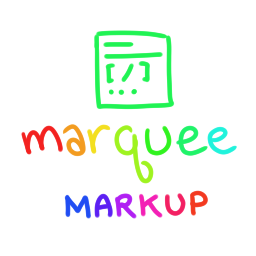

# Marquee (Markup)

[](https://github.com/cube-drone/marqueemarkup/actions/workflows/ci.yml)

**[✨ Live demo](https://cube-drone.github.io/marqueemarkup/)** rendered from — [WRITING.mq](./WRITING.mq),
on the tip of `main`, on every push, using [this script](https://github.com/cube-drone/marqueemarkup/blob/main/scripts/build-pages.ts).

Marquee is a markup language! 

It's designed to be a mash-up of Markdown, BBCode, RST, and the old web. 

## Why Wouldn't I Just Use Markdown?

Sheer vibes. Stubborn nostalgia. And, secretly? _Draconian control_.

The use-cases for Marquee are shaped like "Geocities" or "Messaging" -
if you're hosting other users' content, you can't technically offer 
them all of Markdown, because Markdown allows pass-through HTML 
and pass-through HTML is a security vulnerability.

If you take away the pass-through HTML, Markdown is really... small.
Which is why every application actually shares "Markdown ... minus HTML,
plus a bunch of tacked-on stuff that only works in this application."

So that's what Marquee is: Markdown, minus HTML, plus a bunch of tacked-on
stuff that you might need if you're want to give your users more options
to get silly than you get from the cracker-dry Markdown spec.

Learning some lessons from Markdown's storied history, Marquee is... 
very, very tightly specified. If you have some text, there is 
_exactly and only one_ valid intermediary tree representation for that text: 
that's it. Renderers can _render_ that tree in a variety of ways, but the
tree itself is set in stone when you give it a document, and thanks to 
the tight versioning from version 0, 
that will be true from now until the end of time. 

As for the extra crap we tacked on? Well, there's basic layout primitives,
footnotes, colors, a constrained but versatile set of fonts, an expandable
and customizable set of emoji, animation 
(including, _of course_, the legendary "Marquee"), sizing, and 
an open format for expandable openGraph-chasing links ("turbolinks"). 

In some ways, Marquee is like a lightweight, highly constrained early 90's version of HTML. 

That's what Marquee is designed for: the intersection between wire safety and 
hot piles of clown nonsense.

Safe. Clown. Nonsense.

## Why Wouldn't I Just Use HTML?

The security problem with Markdown is partially that it _can include HTML_.

HTML is _guaranteed to include HTML_, and proving that HTML is safe is
extremely hard.

Also, there's essentially no chance that you can convince a casual user
to type HTML into a messaging window. That is crazy people talk. 

## Writing Marquee

A more in-depth "writing" document is available [here](./WRITING.md), but 
this will get you started:


`````
# Header 1
## Header 2
### Header 3

*italics*
**strong**

* list
* list
  * list in a list
    * list in a list in a list

1. list
2. list
3. list

%% comment (you can't see this)

  %% a lot of Marquee's tags can't survive 
  %% any space between them and the beginning 
  %% of the line, this comment is invalid (and visible)

[link](https://example.org)


standalone links expand into content: 

https://www.youtube.com/watch?v=kiTpHaShznE

Text can be sized: 

* [teeny]teeny[/teeny]
* [tiny]tiny[/tiny]
* [small]small[/small]
* [big]big[/big]
* [huge]huge[/huge]
* [enormous]ENORMOUS[/enormous].

Superscripted or subscripted: 

* E = mc[sup]2[/sup], 
* H[sub]2[/sub]O, 

Colored: 

* [color=goldenrod]color by name[/color]
* [color=#f06]color by hex[/color]

Footnote-style asides[sidenote]like this one [/sidenote] that never interrupt
the sentence, they just show up later.

[font=press-start]Fonts, but they come from a pre-defined list?[/font].

* [blink]blink[/blink]
* [rainbow]rainbow[/rainbow]
* [bounce]bounce[/bounce]
* [jitter]jitter[/jitter]
* [wave]wave[/wave]
* [typewriter speed=30]typewriter[/typewriter]

Nested animations: [marquee][blink][rainbow]still open at 3am[/rainbow][/blink][/marquee]

* [rainbow by=letter]EVERY LETTER ITS OWN HUE[/rainbow] ·
* [wave by=letter]a true undulating wave[/wave] ·
* [bounce by=word]each word takes its turn[/bounce] ·
* [jitter by=letter]scattered nerves[/jitter]

Code:

````
```
for hat in attic.hats():
    print(hat.vibe, hat.dampness)
```
````

You can also `inline code` like `this`. 

Quotes:

> Every line of the quote is marked,
> line by line — you need to include
> the `>` symbol on every line.

`````


## Getting Started

There are a lot of ways to use Marquee, but the most obvious one is this:

Get it from npm. (Have npm installed.)

```
npm install @cube-drone/marquee-markup
```

Write a script to convert .mq into html:

```ts
import { marquee } from "@cube-drone/marquee-markup";
import { readFileSync, writeFileSync } from "node:fs";

writeFileSync("hello.html", marquee(readFileSync("hello.mq", "utf8")));
```

`marquee(source)` parses, renders, styles, inlines exactly the
fonts the page wears, and hands back a self-contained HTML page. Or use the CLI:

```
npx marquee hello.mq > hello.html     one self-contained page
```

JS docs live [here](./ts/marquee-markup/README.md).


## What If I Don't _Want_ To Program in JS?

Don't worry, we support _both_ programming languages: Javascript AND Rust!

(shuffling noises)

My assistant is informing me that there are "several other programming languages". 

(loud bang)

_(muffled thump)_

(dragging noise)

My assistant has been removed. 

Rust docs are [here](./rust/markup/README.md)


## Repository Layout

### The Stuff You Might Care About As an End User
- `SPEC.md` - the language specification (grammar, AST contract, conformance rules)
- `ts/marquee-markup/` - **the batteries-included whole enchilada and the place to start** -
   if you want to use marquee like a library or a CLI app, start here
- `rust/markup/` - **the same thing as above, but Rust instead**: again, marquee as a user-friendly library
   and CLI app, this time in Rust! 
- `editors/vscode-marquee/` - **VS Code syntax highlighting**: 
- `editors/vim-marquee/` - **It's like VS Code, but instead of being that it's vim/neovim**

### Deep Lore For Wizards and The Clinically Insane

- `examples/` - hand-written `.mq` documents; the ergonomics testbed and vector seed corpus
  (`examples/borsalino/` is a complete little website with shared nav/footer, built via
  `npm run marquee -- examples/borsalino /tmp/borsalino`)
- `vectors/` - published conformance vectors (`*.json`, input → exact AST); see `vectors/README.md`
- `rust/parser/` - reference parser, Rust (`cargo test` runs the vectors; `cargo run --bin bless` grows them)
- `rust/html_renderer/` - reference static HTML renderer, Rust: same class contract and Profile
  socket as the TypeScript renderer, its own behavioral suite and self-goldens
  (`cargo run --bin bless` re-blesses)
- `ts/parser/` - reference parser, TypeScript (`npm test` runs the same vectors; `npm run check` typechecks)
- `ts/html_renderer/` - reference static HTML renderer (fragment out, embedder policy via `Profile`;
  behavioral suite encodes the spec's renderer obligations, self-goldens catch regressions)
- `ts/marquee-turbolink/` - pluggable turbolink rendering: link expanders as plugins (YouTube, Spotify, media,
  OpenGraph-fetch-ahead), composed by the embedder into `Profile.turbolink`; each plugin declares the
  CSS for the markup it emits, and `turbolinkStyles()` collects the composed chain's skins into one artifact
- `ts/marquee-turbolink-example-plugin/` - the worked example for plugin authors, paired with the
  "Writing a plugin" guide in `ts/marquee-turbolink/README.md`
- `ts/marquee-css/` - the reference stylesheet as a package: the `mq-*` class contract renderers
  target, effects under `prefers-reduced-motion`, layouts, schemes (file + string export)
- `ts/marquee-fonts/` - the 31-face grab bag as an *optional* package: `externalFontFaces()` for
  hosted files, `inlineFontFaces()` for self-contained base64 pages; without it every font name
  degrades to its fallback stack
- `ts/marquee-emoji/` - gemoji's standard shortcode table repackaged (`:sparkles:` → ✨);
  dependency-free, loaded implicitly by the omnibus
  `marquee(source)` → a complete page, `buildSite(dir, out)` → a website, the `marquee` CLI,
  everything underneath re-exported
- differential fuzzer - `cargo run --release --bin diff_fuzz` (in `rust/parser/`, needs `node` on PATH):
  seeded generated documents through both parsers, identical ASTs demanded; fuzz: overwhelming.

Renderers land beside the parsers as they come (`rust/html_renderer`, `ts/html_renderer`,
`ts/preact_interactive_renderer`, ...): one parser per language, many renderers, per the
"parsers may never differ, renderers may" contract in the spec.

## Published Packages

This is a monorepo: the spec, the conformance vectors, and every reference implementation
version together, because they are one conformance unit. (Basically: we can't change anything without changing EVERYTHING.) 
The implementations publish piecemeal as public infrastructure — 

- npm: 
  - `@cube-drone/marquee-markup` (the user-facing one)
  - `@cube-drone/marquee-parser` (.mq -> AST)
  - `@cube-drone/marquee-html-renderer` (AST -> HTML),
  - `@cube-drone/marquee-turbolink` (link expansion), 
  - `@cube-drone/marquee-css` (the shiny bits), 
  - `@cube-drone/marquee-fonts` (it's just a bunch of SIL fonts), 
  - `@cube-drone/maruqee-emoji`, (gemoji)
- crates.io:
  - `cube-drone-markup` (the user-facing one) 
  - `cube-drone-marquee-parser` (.mq -> AST), 
  - `cube-drone-html-renderer` (AST -> HTML),
  - (most of the stuff that was packaged as separate JS repos up there are just crammed in the HTML renderer here) 

(crates.io has no scopes, so the registry names wear the cube-drone prefix while the code stays `use marquee_parser`) — and
downstream embedders consume them through the public registries like anybody else. The TypeScript side is an npm workspace: `npm install` once at the root,
`npm test` runs every package.)